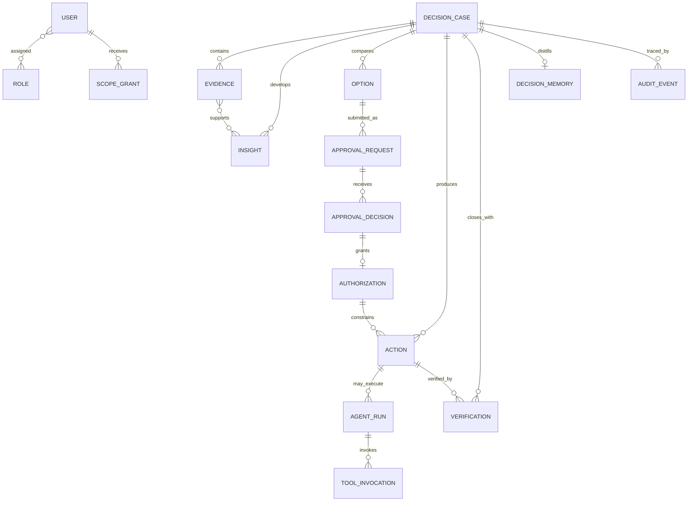

# 领域模型

## 1. 建模原则

- Decision Case 是聚合根与协作上下文，但 Evidence、Approval、Action、Agent Run 等拥有独立生命周期和标识。
- 批准与验证引用不可变的 Case/Option/Evidence 版本，避免事后修改历史含义。
- 事实、计算结果、人工判断与 Agent 内容保存来源类型，不混写。
- 删除业务展示不等于删除审计证据；生产保留与隐私政策仍待确认。

## 2. 核心对象

### 2.1 DecisionCase

| 字段组 | 关键字段 |
| --- | --- |
| 标识 | case_id、title、case_type（forecast/resource/performance）、version |
| 背景 | trigger、business_context、scope、period、legal_entity/business/site |
| 治理 | owner、participants、reviewers、approvers、risk_level、sensitivity、due_at |
| 状态 | lifecycle_status、quality_gate_status、created/updated/closed_at |
| 决策 | assumptions、insight_refs、option_refs、recommended_option、confidence、dissent/risk |
| 闭环 | required_authorization、approval_refs、action_refs、verification_refs、memory_ref |

约束：提交前必须满足类型模板；一项可有多个版本但只有一个当前版本；关闭前必须完成验证或记录经批准的“不可验证”原因。

### 2.2 Evidence

`evidence_id, case_id, source_type, source_name, mock_flag, dataset/file_version, as_of, period, scope, owner, ingested_by, quality_status, lineage_steps, checksum, access_classification, citations`。

Evidence 是引用快照而非可变链接；若源数据更新，应产生新版本。模拟原型中 `mock_flag` 必须为 true。

### 2.3 Insight

`insight_id, case_id, statement, kind(anomaly/trend/driver/risk), author_type(human/agent), evidence_refs, method, assumptions, confidence, limitations, review_status, reviewer, version`。Insight 不得在没有 Evidence 或显式“人工判断”标签时呈现为事实。

### 2.4 Option

`option_id, case_id, name, description, baseline_flag, assumptions, financial_impact, operational_impact, cash_impact, timeframe, risk, sensitivity, dependencies, reversibility, created_by, version`。推荐通过 `Recommendation` 或 Case 字段引用 Option，不能删除未选方案以美化历史。

### 2.5 Approval 与 Authorization

- **ApprovalRequest：**请求批准某一 `case_version + option_version + evidence_snapshot`，含路由、阈值依据和 SoD 检查。
- **ApprovalDecision：**approver、decision、reason、conditions、decided_at、delegation_ref。
- **Authorization：**批准产生的可执行边界：subject、action/tool、target、amount/quantity、valid_from/to、conditions、stop/revoke rules、status。

批准不直接等于执行；Action/Agent Run 必须引用有效 Authorization。

### 2.6 Action

`action_id, primary_case_id, related_case_ids, title, owner, executor_type, due_at, milestones, dependencies, status, progress, expected_value_ref, exception_state, authorization_ref, evidence_refs`。跨 Case 共享时仅主 Case 计一次价值。

### 2.7 Verification

`verification_id, case_id/action_id, expected_baseline_snapshot, actual_value, variance, metric/period, result_evidence, attribution, confounders, verified_by, verification_status, reviewed_at, lessons`。预期基线在授权时锁定，不得随实际结果回写。

### 2.8 User、Role、Scope 与 Delegation

- **User：**合成身份、组织归属、状态；生产由企业 IdP 映射。
- **Role：**一组动作权限（查看、编辑、提交、复核、审批、执行、监督、配置）。
- **ScopeGrant：**业务、法人、基地、成本中心、事项或数据分类范围及有效期。
- **Delegation：**委托人/代理人、权限子集、事项范围、额度、起止时间、状态和批准依据。

有效权限 = 角色动作 ∩ ScopeGrant ∩ Case 参与关系 ∩ 数据分类策略 ∩ 动态条件；显式拒绝优先。

### 2.9 AgentRun 与 ToolInvocation

- **AgentRun：**run_id、purpose、case/version、agent/模型配置版本、input_refs、prompt/policy_version、status、confidence、limitations、initiator、started/stopped/completed_at、authorization_ref。
- **ToolInvocation：**tool_call_id、run_id、connector/tool、requested_action、target、input/output摘要、idempotency_key、policy_result、approval_ref、status、receipt、timestamps。

仅保存可审计解释、输入输出与决策依据，不要求记录或展示模型私有思维链。

### 2.10 AuditEvent 与 DecisionMemory

- **AuditEvent：**event_id、UTC timestamp、actor_type/id、action、object_type/id/version、before/after摘要或哈希、reason、correlation_id、policy_result、source IP/device（生产可选）。追加式记录。
- **DecisionMemory：**经审核的 Case 摘要、适用范围、关键假设、结果、可复用教训、来源 Case/Verification、reviewer、有效期/复审日期。

## 3. 关系图

## 4. 生命周期与不变量

- ApprovalRequest 提交后，其目标快照不可变；材料变化需撤回并重提。
- Authorization 过期/撤销后禁止新的 ToolInvocation，既有事件保留。
- Agent Run 只能建议（L1），或在明确授权下执行白名单动作（L2）。
- Case 关闭不级联删除 Action、Verification 或审计。
- 知识发布需要人审；过时知识可失效但仍保留版本。
